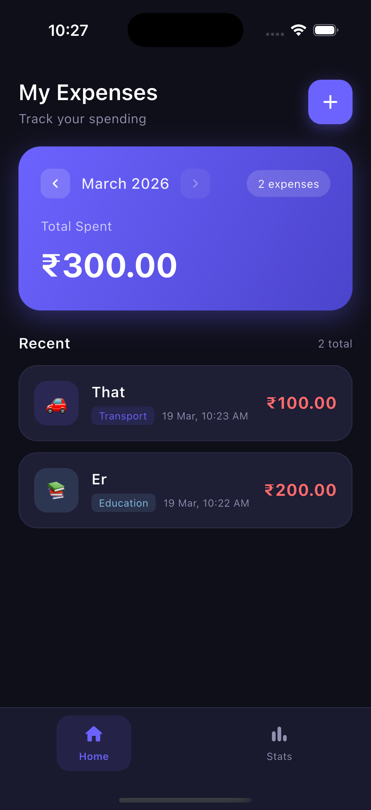
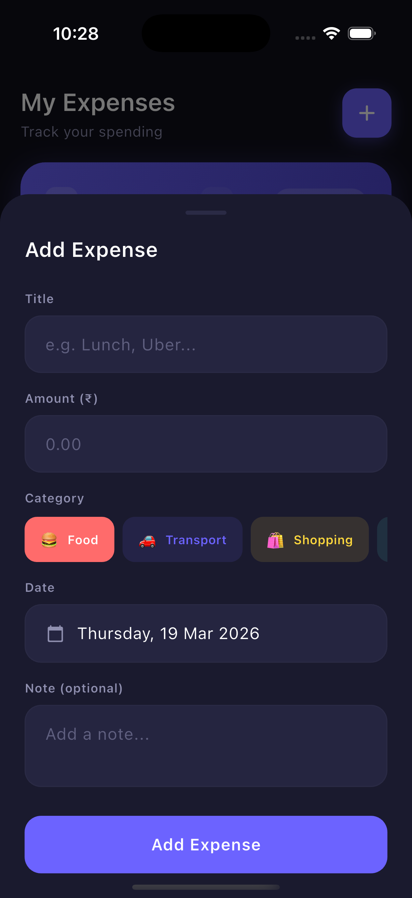
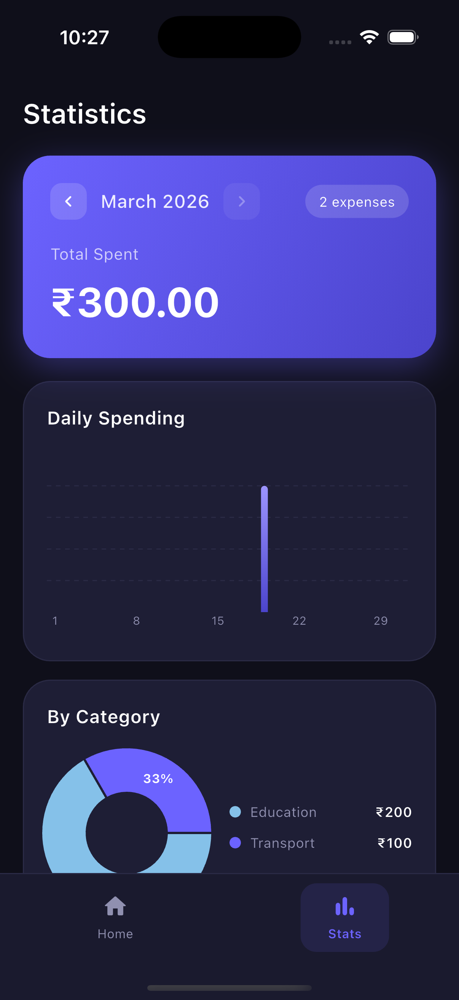

# 💸 Expense Tracker App

A practical, polished expense tracking app built with **Flutter**, powered by **Provider** for state management and structured with **Clean Architecture** principles. Track spending, visualise monthly stats with interactive charts, and stay on budget.

---

## 📱 App Screens

<p align="center">
  
  
  
</p>

---

## 🚀 Features

* ➕ Add, edit and delete expenses with a smooth bottom sheet
* 🗂️ 8 built-in categories — each with emoji and unique colour
* 📅 Date picker for each expense entry
* 💬 Optional note on every expense
* 📊 Monthly summary card with ← → month navigation
* 🥧 Interactive category pie chart — tap a slice to highlight it
* 📈 Daily spending bar chart with gradient bars and tooltip
* 📋 Category breakdown with colour-coded progress bars
* 🗑️ Swipe-to-delete on expense list tiles
* 💾 **SQLite** local persistence — data survives restarts
* 🔄 Pull-to-refresh on home screen
* ↕️ Bottom navigation between Home and Stats tabs

---

## 🏗️ Architecture

This project follows **Clean Architecture** with a feature-based folder structure:

```
lib/
 ├── core/
 │   ├── theme/              # Colors, text styles, full dark theme
 │   ├── utils/              # Constants, 8 category definitions
 │   └── error/              # Failure types
 ├── features/
 │   └── expense/
 │       ├── data/
 │       │   ├── models/         # ExpenseModel (entity ↔ SQLite map)
 │       │   ├── datasources/    # ExpenseLocalDataSource (sqflite)
 │       │   └── repositories/   # ExpenseRepositoryImpl
 │       ├── domain/
 │       │   ├── entities/       # Expense entity
 │       │   ├── repositories/   # ExpenseRepository (abstract)
 │       │   └── usecases/       # 8 use cases (CRUD + aggregations)
 │       └── presentation/
 │           ├── providers/      # ExpenseProvider (ChangeNotifier)
 │           ├── pages/          # HomePage, StatsPage, RootShell
 │           └── widgets/        # MonthlySummaryCard, ExpenseListTile
 │                               # CategoryPieChart, DailyBarChart
 │                               # AddExpenseSheet
 ├── injection_container.dart    # Manual DI wiring
 └── main.dart
```

### 🔁 State Management

* Uses **Provider** (`ChangeNotifier`) with a single `ExpenseProvider`
* `loadMonth()` is the single refresh point — called after every mutation
* Exposes monthly total, category totals, daily totals, and sorted lists
* Month navigation (`goToPreviousMonth` / `goToNextMonth`) updates all data

---

## 🎨 UI Highlights

* 🌑 Deep navy-purple dark theme throughout
* 💜 Purple gradient summary card with animated month navigation arrows
* 🥧 Touchable pie chart — tap a slice to see it expand and show label
* 📊 Gradient bar chart (indigo → violet) with dashed grid lines
* 🏷️ Horizontal scrollable category chip picker in add sheet
* ⌨️ Bottom sheet auto-adjusts for keyboard (`viewInsets.bottom`)

---

## 📊 Charts

| Chart | Library | Details |
|---|---|---|
| Pie chart | fl_chart | Category totals, interactive touch |
| Bar chart | fl_chart | Daily totals, gradient fill, tooltips |
| Progress bars | Flutter | Category % of monthly total |

---

## 🗂️ Categories

| Emoji | Name | Colour |
|---|---|---|
| 🍔 | Food | Red |
| 🚗 | Transport | Purple |
| 🛍️ | Shopping | Yellow |
| 🎮 | Entertainment | Teal |
| 💊 | Health | Green |
| 💡 | Bills | Orange |
| 📚 | Education | Blue |
| 📦 | Other | Pink |

---

## 🧪 Tech Stack

| Layer | Technology |
|---|---|
| UI Framework | Flutter |
| Language | Dart |
| State | Provider (ChangeNotifier) |
| Local DB | SQLite (sqflite) |
| Charts | fl_chart |
| IDs | uuid |
| Architecture | Clean Architecture |

---

## 📦 Dependencies

```yaml
provider: ^6.1.2
equatable: ^2.0.5
sqflite: ^2.3.3
path: ^1.9.0
intl: ^0.19.0
uuid: ^4.4.0
fl_chart: ^0.69.0
```

---

## 🚀 Getting Started

```bash
git clone <repo-url>
cd expense_tracker
flutter pub get
flutter run
```

No API keys needed — all data is stored locally on device.

---

## 🤝 Contributing

Contributions are welcome! Feel free to fork this repo and submit a PR.

---

## 📄 License

This project is licensed under the MIT License.
